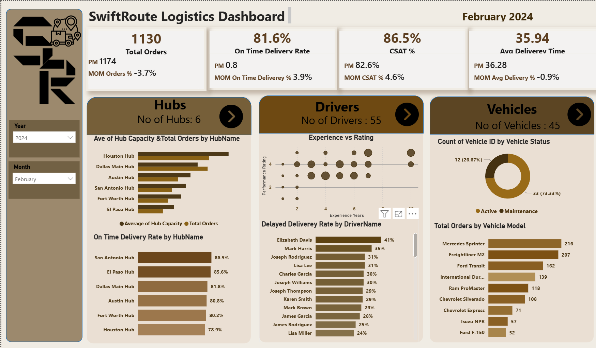

# Logistics Performance Dashboard

## Project Overview
This Power BI dashboard analyzes logistics operations and delivery performance through interactive visualizations and key performance indicators.

## Tools Used
- Power BI
- Power Query
- DAX
- Data Modeling

## Key KPIs
- Total Orders
- Delivered Orders
- Delayed Orders
- On-Time Delivery Rate
- Average Delivery Time
- Customer Satisfaction (CSAT)

## Dashboard Pages
- Executive Overview
- Drivers Analysis
- Hubs Analysis
- Vehicles Analysis
## Dashboard Preview

### Executive Dashboard

